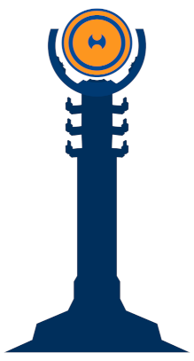
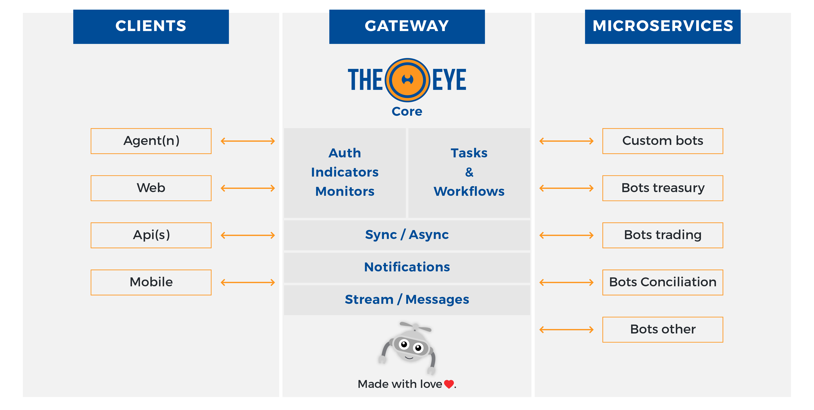

# TheEye Supervisor Core API

## What is TheEye?

<table>
  <tr>
    <td> </td>
    <td> TheEye is a process automation platform developed in NodeJS. Best used as BPM, Rapid Backoffice Development (RDA) and processes' hub.
Technically TheEye is a choreographer 
    </td>
  </tr> 
</table>

  

    

      <table>
        <th></th>
        <th></th>
        <th></th>
        <th></th>
        <th></th>
        <th></th>
      </table>
    

  

## Architecture

If you want more information please read the https://documentation.theeye.io

## Environment settings

Provide this env variables to change the initial behaviour of the core Api. Once started cannot be changed.

* Rest API - Api to interactar with TheEye resources. https://documentation.theeye.io/api/auth/

* Monitoring System - It works as a background process. Will check Monitors status.

* Internal commander API (listen on port 6666 only localhost) - This API is not documented. It is used only for internal management purpose.

### Environment configuration

Basic configuration

| Variable Name | Usage |
| ----- | ----- |
| PORT | change rest api port. default 60080 |
| NODE_ENV | choose the configuration file that the api should use. |
| DEBUG | enabled/disable the debug module. check npm debug module for more information |
| THEEYE_NODE_HOSTNAME | this features extends the debug module. add the hostname to debug output and used to define a Hostname on Dockers |
| VERSION | api version. if not provided will try to detected the version using git. |
| CONFIG_NOTIFICATIONS_API_URL | target notification system url |

Components Control. Can be configured to do one o more things (or nothing)

| Variable Name | Usage |
| ----- | ----- |
| COMMANDER_DISABLED | disable internal commander api |
| MONITORING_DISABLED | disable monitoring system. system monitors will not be checked anymore. will only change when bots and agents send updates |
| API_DISABLED | disable rest api |
| SCHEDULER_JOBS_DISABLED | disable internal scheduler execution. scheduler-jobs will be created using the rest api but task will never be executed. theeye-jobs execution timeout will be never checked. |

### Start development sample

`DEBUG=*eye* NODE_ENV=localdev MONITORING_DISABLED= SCHEDULER_JOBS_DISABLED= npx nodemon --inspect $PWD/core/main.js`
